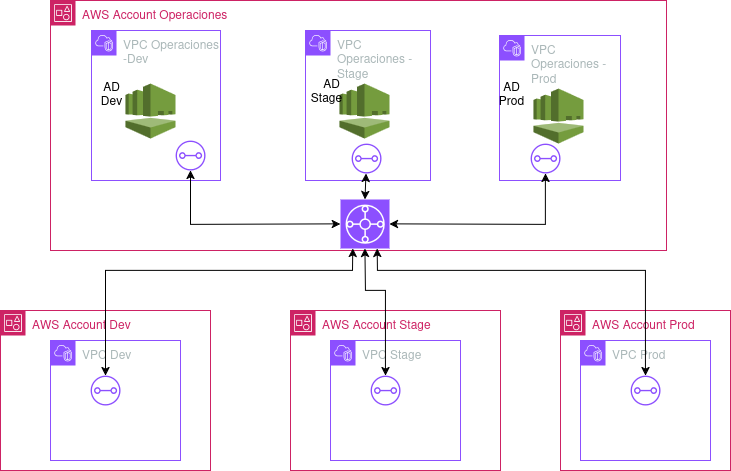

# Infraestructura Multi-Cuenta con Transit Gateway y Directory Service

## Descripción del Proyecto

Este proyecto implementa una infraestructura AWS que permite compartir servicios de AWS Directory Service entre múltiples cuentas utilizando AWS Transit Gateway. La solución está diseñada para organizaciones que necesitan centralizar la gestión de identidades mientras mantienen una separación clara entre entornos de desarrollo, pruebas y producción.

## Arquitectura



La infraestructura consta de:

- **Cuenta Operaciones**: Contiene el Transit Gateway y tres VPCs (Dev, Stage, Prod) cada una con su propio servicio de AWS Directory Service.
- **Cuenta Dev**: Contiene una VPC conectada al Transit Gateway para acceder a los servicios de directorio.
- **Cuenta Stage**: Contiene una VPC conectada al Transit Gateway para acceder a los servicios de directorio.
- **Cuenta Prod**: Contiene una VPC conectada al Transit Gateway para acceder a los servicios de directorio.

## Componentes Principales

### 1. Transit Gateway

El Transit Gateway actúa como un hub central que permite la conectividad entre todas las VPCs en diferentes cuentas. Se despliega en la cuenta de Operaciones y se comparte con las demás cuentas mediante AWS Resource Access Manager (RAM).

Características:
- **Auto-aceptación de Attachments**: Configurado para aceptar automáticamente los attachments de otras cuentas.
- **Appliance Mode Habilitado**: Todos los Transit Gateway Attachments tienen habilitado el modo "appliance" para mejorar el enrutamiento del tráfico.
- **Compartición mediante RAM**: El Transit Gateway se comparte con otras cuentas mediante AWS Resource Access Manager.

### 2. Directory Service

Se implementan tres instancias de AWS Directory Service (Microsoft AD) en la cuenta de Operaciones:
- Directory Service para entorno Dev (`dev.local`)
- Directory Service para entorno Stage (`stage.local`)
- Directory Service para entorno Prod (`prod.local`)

Cada servicio de directorio se despliega en su propia VPC para mantener el aislamiento adecuado.

### 3. VPCs y Conectividad

- **Cuenta Operaciones**: Contiene tres VPCs, cada una con su propio servicio de directorio.
- **Cuentas Dev, Stage y Prod**: Cada una contiene una VPC que se conecta al Transit Gateway para acceder a los servicios de directorio correspondientes.

### 4. Arquitectura de Red Mejorada

La infraestructura ha sido refactorizada para incluir:

- **Subnets Públicas y Privadas**: Cada VPC ahora tiene subnets públicas y privadas
  - Las subnets públicas tienen `map_public_ip_on_launch = true` para asignar automáticamente IPs públicas
  - Las subnets privadas se utilizan para recursos que no necesitan acceso directo desde Internet

- **Componentes de Conectividad a Internet**:
  - **Internet Gateways**: Cada VPC tiene su propio Internet Gateway para permitir acceso directo a Internet
  - **NAT Gateways**: Implementados en cada VPC para permitir que las instancias en subnets privadas accedan a Internet
  - **Elastic IPs**: Asignadas a cada NAT Gateway para proporcionar direcciones IP estáticas

- **Tablas de Ruteo Separadas**:
  - **Tablas de Ruteo Públicas**: Configuradas con rutas directas al Internet Gateway
  - **Tablas de Ruteo Privadas**: Configuradas con rutas a través del NAT Gateway para acceso a Internet y rutas al Transit Gateway para comunicación entre VPCs

## Últimas Mejoras Implementadas

### 1. Reglas de Seguridad Específicas para ENIs de Directory Services

Se ha implementado una configuración avanzada de seguridad para los ENIs (Elastic Network Interfaces) de los Directory Services:

- **Reglas específicas por servicio y cuenta**: Cada Directory Service (Dev, Stage, Prod) ahora permite tráfico solo desde su cuenta correspondiente:
  - Directory Service Dev → Permite tráfico solo desde la cuenta Dev
  - Directory Service Stage → Permite tráfico solo desde la cuenta Stage
  - Directory Service Prod → Permite tráfico solo desde la cuenta Prod

- **Puertos específicos**: Se han configurado reglas para permitir solo los puertos necesarios para AWS Directory Service:
  - DNS (TCP/UDP 53)
  - Kerberos (TCP/UDP 88)
  - LDAP (TCP/UDP 389)
  - SMB/CIFS (TCP 445)
  - LDAPS (TCP 636)
  - Kerberos password change (TCP/UDP 464)
  - Global Catalog (TCP 3268-3269)
  - NTP (UDP 123)
  - RPC (TCP 135)
  - Puertos efímeros para RPC (TCP/UDP 1024-65535)
  - ICMP para ping

- **Mecanismo de espera mejorado**: Se ha implementado un mecanismo de espera de 90 segundos para asegurar que las reglas se apliquen después de que los ENIs estén completamente disponibles.

### 2. Reorganización de Scripts de Prueba

Se han reorganizado los scripts de prueba para mejorar la estructura del proyecto:

- **Nuevo directorio `test_connections/`**: Todos los scripts de prueba se han movido a este directorio.
- **Scripts disponibles**:
  - `test_conectividad.sh`: Pruebas de conectividad entre VPCs
  - `test_directory_service.sh`: Pruebas de Directory Services
  - `test_transit_gateway.sh`: Pruebas de Transit Gateway
  - `test_conectividad_cloudshell.sh`: Generación de scripts para CloudShell
- **Script principal actualizado**:
  - `run_all_tests.sh`: Actualizado para ejecutar los scripts desde la nueva ubicación.

### 3. Mejoras en la Documentación

- **README consolidado**: Se ha consolidado toda la documentación en un único README completo y bien estructurado.
- **Secciones actualizadas**: Se han actualizado las secciones para reflejar los últimos cambios en la arquitectura y configuración.

## Beneficios de la Arquitectura

1. **Centralización de la gestión de identidades**: Un único punto para administrar usuarios y políticas.
2. **Separación de entornos**: Cada entorno (Dev, Stage, Prod) tiene su propio servicio de directorio aislado.
3. **Seguridad mejorada**: La conectividad entre cuentas está estrictamente controlada a través del Transit Gateway.
4. **Escalabilidad**: Fácil de expandir para incluir más cuentas o servicios adicionales.
5. **Acceso a Internet**: Todas las instancias pueden acceder a Internet, ya sea directamente o a través de NAT Gateways.
6. **Flexibilidad**: Posibilidad de desplegar recursos tanto en zonas públicas como privadas según necesidades.
7. **Resiliencia**: NAT Gateways en cada VPC proporcionan redundancia.
8. **Seguridad granular**: Reglas de seguridad específicas para cada servicio y cuenta.

## Seguridad de los Servicios de Directorio

### Configuración de Grupos de Seguridad

Los grupos de seguridad de los servicios de directorio se configuran automáticamente con reglas específicas para los puertos y protocolos requeridos por AWS Directory Service:

#### Puertos y Protocolos Configurados

| Puerto | Protocolo | Servicio | Descripción |
|--------|-----------|----------|-------------|
| 53 | TCP/UDP | DNS | Resolución de nombres de dominio |
| 88 | TCP/UDP | Kerberos | Autenticación |
| 389 | TCP/UDP | LDAP | Directorio de usuarios y grupos |
| 445 | TCP | SMB/CIFS | Compartición de archivos |
| 636 | TCP | LDAPS | LDAP sobre TLS/SSL |
| 464 | TCP/UDP | Kerberos | Cambio de contraseña |
| 3268-3269 | TCP | Global Catalog | Búsquedas en el catálogo global |
| 123 | UDP | NTP | Sincronización de tiempo |
| 135 | TCP | RPC | Llamadas a procedimientos remotos |
| 1024-65535 | TCP/UDP | Ephemeral | Puertos efímeros para RPC |

#### Implementación Eficiente

- Uso de locals para definir todos los puertos y protocolos necesarios
- Uso de bucles for_each para aplicar las mismas reglas a todos los servicios de directorio
- Reglas específicas para cada servicio y cuenta cliente correspondiente

#### Principio de Privilegio Mínimo

- Solo se permiten los puertos y protocolos específicos necesarios para AWS Directory Service
- Se evita abrir rangos completos de puertos innecesariamente
- Cada regla tiene una descripción clara de su propósito
- Cada servicio de directorio solo permite tráfico desde su cuenta cliente correspondiente

#### Mecanismo de Espera

- Las reglas se aplican automáticamente después de que los servicios de directorio estén disponibles
- Se utiliza el proveedor `time` para implementar un mecanismo de espera de 90 segundos
- Todas las reglas dependen de este mecanismo para evitar condiciones de carrera

### Consideraciones de Seguridad Adicionales

- Los Directory Services ahora se despliegan en subnets privadas
- Esto mejora la seguridad al no exponer directamente los servicios de directorio a Internet
- Los Transit Gateway Attachments ahora se conectan a las subnets privadas
- Esto mantiene el tráfico entre VPCs dentro de la red privada mientras permite acceso a Internet

## Requisitos

- Terraform >= 1.2.0
- AWS CLI configurado con perfiles para cada cuenta

## Estructura del Proyecto

```
.
├── main.tf                  # Configuración principal de Terraform
├── variables.tf             # Definición de variables
├── provider.tf              # Configuración de proveedores AWS
├── terraform.tfvars.example # Ejemplo de valores para variables
├── modules/
│   ├── operaciones/         # Módulo para la cuenta de Operaciones
│   │   ├── main.tf          # Recursos principales
│   │   ├── directory_service.tf # Configuración de Directory Services
│   │   ├── directory_security.tf # Grupos de seguridad para Directory Services
│   │   └── directory_eni_rules.tf # Reglas para ENIs de Directory Services
│   ├── dev/                 # Módulo para la cuenta de Dev
│   ├── stage/               # Módulo para la cuenta de Stage
│   └── prod/                # Módulo para la cuenta de Prod
├── test_connections/        # Scripts de prueba de conectividad
│   ├── test_conectividad.sh # Pruebas de conectividad entre VPCs
│   ├── test_directory_service.sh # Pruebas de Directory Services
│   ├── test_transit_gateway.sh # Pruebas de Transit Gateway
│   └── test_conectividad_cloudshell.sh # Generación de scripts para CloudShell
└── connectivity_test_results/ # Resultados de las pruebas de conectividad
```

## Gestión de Secretos y Archivos Sensibles

Este proyecto utiliza archivos `.gitignore` para evitar que información sensible se suba al repositorio:

1. **Archivos de variables**: Los archivos `.tfvars` que contienen valores reales no se incluyen en el repositorio. Usa `terraform.tfvars.example` como plantilla.

2. **Archivos de estado**: Los archivos de estado de Terraform (`.tfstate`) contienen información sensible y no se incluyen en el repositorio.

3. **Archivos de entorno**: Usa el archivo `.env.example` como plantilla para crear tu propio archivo `.env` con tus credenciales.

4. **Directorios de Terraform**: Los directorios `.terraform/` y archivos de bloqueo no se incluyen en el repositorio.

Para configurar tu entorno local:

```bash
# Copiar y editar el archivo de variables de ejemplo
cp terraform.tfvars.example terraform.tfvars

# Copiar y editar el archivo de entorno de ejemplo
cp .env.example .env
```

## Configuración y Despliegue

### Configuración de Perfiles AWS

Configura los perfiles de AWS CLI para cada cuenta:

```bash
# ~/.aws/credentials
[operaciones]
aws_access_key_id = YOUR_ACCESS_KEY
aws_secret_access_key = YOUR_SECRET_KEY

[dev]
aws_access_key_id = YOUR_ACCESS_KEY
aws_secret_access_key = YOUR_SECRET_KEY

[stage]
aws_access_key_id = YOUR_ACCESS_KEY
aws_secret_access_key = YOUR_SECRET_KEY

[prod]
aws_access_key_id = YOUR_ACCESS_KEY
aws_secret_access_key = YOUR_SECRET_KEY
```

### Despliegue de la Infraestructura

1. Inicializa Terraform:

```bash
terraform init
```

2. Planifica el despliegue utilizando los perfiles específicos:

```bash
./run_terraform_plan_profiles.sh
```

3. Aplica la configuración:

```bash
./run_terraform_apply_profiles.sh
```

## Scripts de Utilidad

### Scripts de Despliegue y Corrección

#### fix_transit_gateway_routes.sh

Este script soluciona problemas de referencia con el Transit Gateway en las rutas:

- **Propósito**: Corrige errores de tipo `InvalidTransitGatewayID.NotFound` que ocurren cuando las rutas intentan usar una referencia simbólica al Transit Gateway que aún no existe o ha cambiado.
- **Funcionamiento**: 
  1. Identifica el ID real del Transit Gateway existente en AWS
  2. Actualiza el archivo `modules/operaciones/main.tf` reemplazando las referencias simbólicas con el ID real
  3. Crea una copia de seguridad del archivo original en `modules/operaciones/main.tf.bak`
  4. Ejecuta un plan de Terraform para verificar los cambios
- **Cuándo usarlo**:
  * Después de crear el Transit Gateway pero antes de crear las rutas que lo utilizan
  * Cuando aparecen errores de tipo `InvalidTransitGatewayID.NotFound` durante la aplicación de Terraform
  * Cuando se ha recreado el Transit Gateway y las referencias antiguas ya no son válidas
- **Uso**:
  ```bash
  ./fix_transit_gateway_routes.sh
  ```
- **Después de ejecutarlo**: Ejecuta `run_terraform_apply_profiles.sh` para aplicar los cambios corregidos

#### run_terraform_plan_profiles.sh

Este script ejecuta `terraform plan` utilizando los perfiles AWS configurados:

- **Funcionalidad**: Configura los perfiles AWS y ejecuta `terraform plan` para generar un plan de despliegue.
- **Uso**:
  ```bash
  ./run_terraform_plan_profiles.sh
  ```

#### run_terraform_apply_profiles.sh

Este script aplica la configuración de Terraform utilizando los perfiles AWS configurados:

- **Funcionalidad**: Configura los perfiles AWS y ejecuta `terraform apply` para desplegar la infraestructura.
- **Uso**:
  ```bash
  ./run_terraform_apply_profiles.sh
  ```

### Scripts de Prueba de Conectividad

#### ATENCION: la solucion implementa que solo las subnets privadas lleguen a los AWS Directory Service, por ende para ejectuar estas pruebas, donde se crean instancias EC2 en subnets publicas, debera en cada cuenta editar las tablas de ruteo para que las subnets publicas lleguen a las redes de las VPC de sus respectivos servicios de directorio a travez del TGW. Luego eliminar esas rutas por seguridad

El directorio `test_connections/` contiene varios scripts para probar diferentes aspectos de la infraestructura:

#### 1. test_conectividad.sh

Este script realiza pruebas completas de conectividad entre todas las VPCs desplegadas:

- **Funcionalidad**: Crea instancias EC2 temporales en cada cuenta (Operaciones, Dev, Stage, Prod) y realiza pruebas de ping entre ellas para verificar la conectividad a través del Transit Gateway.
- **Recursos creados**: Instancias EC2, grupos de seguridad, key pairs.
- **Características mejoradas**:
  - Búsqueda inteligente de subnets públicas para desplegar instancias
  - Asignación automática de IPs públicas a las instancias
  - Asignación de IPs elásticas como fallback si es necesario
  - Verificación de disponibilidad de SSH antes de intentar conexiones
  - Manejo robusto de errores y condiciones excepcionales
- **Limpieza automática**: Elimina todos los recursos creados al finalizar las pruebas, incluyendo IPs elásticas.
- **Uso**:
  ```bash
  ./test_connections/test_conectividad.sh
  ```

#### 2. test_directory_service.sh

Este script verifica el estado de los servicios de directorio desplegados:

- **Funcionalidad**: Obtiene los IDs de los Directory Services y verifica su estado actual.
- **Información mostrada**: Estado de los servicios, configuración de red, detalles de dominio.
- **Uso**:
  ```bash
  ./test_connections/test_directory_service.sh
  ```

#### 3. test_transit_gateway.sh

Este script verifica la configuración y el estado del Transit Gateway:

- **Funcionalidad**: Obtiene el ID del Transit Gateway y verifica su estado y attachments.
- **Información mostrada**: Estado del Transit Gateway, lista de attachments, detalles de configuración.
- **Uso**:
  ```bash
  ./test_connections/test_transit_gateway.sh
  ```

#### 4. test_conectividad_cloudshell.sh

Este script genera scripts específicos para ejecutar en AWS CloudShell en cada cuenta:

- **Funcionalidad**: Crea scripts personalizados para cada cuenta (Operaciones, Dev, Stage, Prod) que pueden ejecutarse en AWS CloudShell.
- **Scripts generados**: 
  - `cloudshell_operaciones.sh`: Pruebas para la cuenta Operaciones
  - `cloudshell_dev.sh`: Pruebas para la cuenta Dev
  - `cloudshell_stage.sh`: Pruebas para la cuenta Stage
  - `cloudshell_prod.sh`: Pruebas para la cuenta Prod
- **Pruebas incluidas**: Verificación de VPCs, Transit Gateway Attachments, tablas de ruteo.
- **Uso**:
  ```bash
  ./test_connections/test_conectividad_cloudshell.sh
  ```
  Luego sigue las instrucciones para subir y ejecutar los scripts en CloudShell de cada cuenta.

### Script para Ejecutar Todas las Pruebas

El script `run_all_tests.sh` en la raíz del proyecto ejecuta todos los scripts de prueba en secuencia:

- **Funcionalidad**: Ejecuta todos los scripts de prueba en el directorio `test_connections/`.
- **Uso**:
  ```bash
  ./run_all_tests.sh
  ```

## Verificación de Configuración de Seguridad

Para verificar que las reglas de seguridad se han aplicado correctamente:

```bash
# Verificar reglas de seguridad para el servicio de directorio Dev
aws ec2 describe-security-group-rules \
  --filter "Name=group-id,Values=[ID_DEL_GRUPO_DE_SEGURIDAD_DEV]" \
  --profile operaciones
```

## Recursos Desplegados

Después de un despliegue exitoso, se crean los siguientes recursos:

### Cuenta de Operaciones
- **Transit Gateway**
- **VPCs**: VPC Operaciones Dev, VPC Operaciones Stage, VPC Operaciones Prod
- **Directory Services**: Directory Dev, Directory Stage, Directory Prod
- **Internet Gateways**, **NAT Gateways** y **Elastic IPs** para cada VPC
- **Subnets públicas y privadas** para cada VPC
- **Tablas de ruteo** para subnets públicas y privadas
- **Reglas de seguridad específicas** para los ENIs de los Directory Services

### Cuentas Dev, Stage y Prod
- **VPC** con subnets públicas y privadas
- **Transit Gateway Attachment**
- **Internet Gateway** y **NAT Gateway**
- **Tablas de ruteo** para subnets públicas y privadas
- **Rutas hacia VPCs de Operaciones**

## Consideraciones para Despliegue

- Esta infraestructura implica cambios significativos en la infraestructura existente
- Se recomienda realizar un despliegue en un entorno de prueba antes de aplicar a producción
- Los NAT Gateways tienen costos asociados que deben considerarse en el presupuesto
- Las reglas de seguridad específicas para los ENIs de los Directory Services pueden requerir ajustes según las necesidades específicas de la organización

## Próximos Pasos Recomendados

1. Implementar grupos de seguridad más granulares para controlar el tráfico entre subnets públicas y privadas
2. Considerar la implementación de endpoints de VPC para servicios AWS para reducir el tráfico a través de Internet
3. Configurar monitoreo y alertas para el tráfico de red a través de los NAT Gateways e Internet Gateways
4. Revisar periódicamente las reglas de seguridad para asegurar que siguen siendo necesarias
5. Mantener actualizados los servicios de directorio para protegerse contra vulnerabilidades conocidas
6. Implementar pruebas automatizadas adicionales para verificar la conectividad y seguridad

## Limpieza

Para eliminar todos los recursos creados:

```bash
./run_terraform_destroy.sh
```

## Conclusión

Esta arquitectura proporciona una solución robusta para organizaciones que necesitan compartir servicios de directorio entre múltiples cuentas AWS, manteniendo al mismo tiempo un alto nivel de seguridad y separación entre entornos. Las últimas mejoras implementadas, especialmente las reglas de seguridad específicas para los ENIs de los Directory Services, mejoran significativamente la postura de seguridad de la infraestructura al aplicar el principio de privilegio mínimo y asegurar que cada servicio de directorio solo sea accesible desde su cuenta cliente correspondiente.
