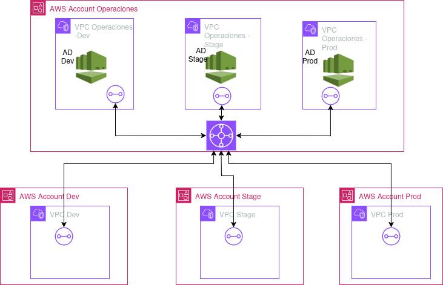

# Multi-Account Infrastructure with Transit Gateway and Directory Service

## Project Description

This project implements an AWS infrastructure that enables sharing AWS Directory Service services across multiple accounts using AWS Transit Gateway. The solution is designed for organizations that need to centralize identity management while maintaining a clear separation between development, testing, and production environments.

## Architecture



The infrastructure consists of:

- **Operations Account**: Contains the Transit Gateway and three VPCs (Dev, Stage, Prod), each with its own AWS Directory Service.
- **Dev Account**: Contains a VPC connected to the Transit Gateway to access directory services.
- **Stage Account**: Contains a VPC connected to the Transit Gateway to access directory services.
- **Prod Account**: Contains a VPC connected to the Transit Gateway to access directory services.

## Main Components

### 1. Transit Gateway

The Transit Gateway acts as a central hub that enables connectivity between all VPCs in different accounts. It is deployed in the Operations account and shared with other accounts through AWS Resource Access Manager (RAM).

Features:
- **Auto-acceptance of Attachments**: Configured to automatically accept attachments from other accounts.
- **Appliance Mode Enabled**: All Transit Gateway Attachments have "appliance mode" enabled to improve traffic routing.
- **Sharing through RAM**: The Transit Gateway is shared with other accounts using AWS Resource Access Manager.

### 2. Directory Service

Three instances of AWS Directory Service (Microsoft AD) are implemented in the Operations account:
- Directory Service for Dev environment (`dev.local`)
- Directory Service for Stage environment (`stage.local`)
- Directory Service for Prod environment (`prod.local`)

Each directory service is deployed in its own VPC to maintain proper isolation.

### 3. VPCs and Connectivity

- **Operations Account**: Contains three VPCs, each with its own directory service.
- **Dev, Stage, and Prod Accounts**: Each contains a VPC that connects to the Transit Gateway to access the corresponding directory services.

### 4. Enhanced Network Architecture

The infrastructure has been refactored to include:

- **Public and Private Subnets**: Each VPC now has public and private subnets
  - Public subnets have `map_public_ip_on_launch = true` to automatically assign public IPs
  - Private subnets are used for resources that don't need direct access from the Internet

- **Internet Connectivity Components**:
  - **Internet Gateways**: Each VPC has its own Internet Gateway for direct Internet access
  - **NAT Gateways**: Implemented in each VPC to allow instances in private subnets to access the Internet
  - **Elastic IPs**: Assigned to each NAT Gateway to provide static IP addresses

- **Separate Route Tables**:
  - **Public Route Tables**: Configured with direct routes to the Internet Gateway
  - **Private Route Tables**: Configured with routes through the NAT Gateway for Internet access and routes to the Transit Gateway for inter-VPC communication

## Latest Improvements

### 1. Specific Security Rules for Directory Services ENIs

An advanced security configuration has been implemented for the Elastic Network Interfaces (ENIs) of Directory Services:

- **Service and account-specific rules**: Each Directory Service (Dev, Stage, Prod) now allows traffic only from its corresponding account:
  - Dev Directory Service → Allows traffic only from the Dev account
  - Stage Directory Service → Allows traffic only from the Stage account
  - Prod Directory Service → Allows traffic only from the Prod account

- **Specific ports**: Rules have been configured to allow only the necessary ports for AWS Directory Service:
  - DNS (TCP/UDP 53)
  - Kerberos (TCP/UDP 88)
  - LDAP (TCP/UDP 389)
  - SMB/CIFS (TCP 445)
  - LDAPS (TCP 636)
  - Kerberos password change (TCP/UDP 464)
  - Global Catalog (TCP 3268-3269)
  - NTP (UDP 123)
  - RPC (TCP 135)
  - Ephemeral ports for RPC (TCP/UDP 1024-65535)
  - ICMP for ping

- **Enhanced waiting mechanism**: A 90-second waiting mechanism has been implemented to ensure that rules are applied after the ENIs are fully available.

### 2. Reorganization of Test Scripts

Test scripts have been reorganized to improve the project structure:

- **New `test_connections/` directory**: All test scripts have been moved to this directory.
- **Available scripts**:
  - `test_conectividad.sh`: Tests connectivity between VPCs
  - `test_directory_service.sh`: Tests Directory Services
  - `test_transit_gateway.sh`: Tests Transit Gateway
  - `test_conectividad_cloudshell.sh`: Generates scripts for CloudShell
- **Updated main script**:
  - `run_all_tests.sh`: Updated to run scripts from the new location.

### 3. Documentation Improvements

- **Consolidated README**: All documentation has been consolidated into a single, comprehensive, and well-structured README.
- **Updated sections**: Sections have been updated to reflect the latest changes in architecture and configuration.

## Benefits of the Architecture

1. **Centralized identity management**: A single point for managing users and policies.
2. **Environment separation**: Each environment (Dev, Stage, Prod) has its own isolated directory service.
3. **Enhanced security**: Connectivity between accounts is strictly controlled through the Transit Gateway.
4. **Scalability**: Easy to expand to include more accounts or additional services.
5. **Internet access**: All instances can access the Internet, either directly or through NAT Gateways.
6. **Flexibility**: Ability to deploy resources in both public and private zones as needed.
7. **Resilience**: NAT Gateways in each VPC provide redundancy.
8. **Granular security**: Specific security rules for each service and account.

## Directory Services Security

### Security Group Configuration

Directory service security groups are automatically configured with specific rules for the ports and protocols required by AWS Directory Service:

#### Configured Ports and Protocols

| Port | Protocol | Service | Description |
|--------|-----------|----------|-------------|
| 53 | TCP/UDP | DNS | Domain name resolution |
| 88 | TCP/UDP | Kerberos | Authentication |
| 389 | TCP/UDP | LDAP | User and group directory |
| 445 | TCP | SMB/CIFS | File sharing |
| 636 | TCP | LDAPS | LDAP over TLS/SSL |
| 464 | TCP/UDP | Kerberos | Password change |
| 3268-3269 | TCP | Global Catalog | Global catalog searches |
| 123 | UDP | NTP | Time synchronization |
| 135 | TCP | RPC | Remote procedure calls |
| 1024-65535 | TCP/UDP | Ephemeral | Ephemeral ports for RPC |

#### Efficient Implementation

- Use of locals to define all necessary ports and protocols
- Use of for_each loops to apply the same rules to all directory services
- Specific rules for each service and corresponding client account

#### Principle of Least Privilege

- Only the specific ports and protocols necessary for AWS Directory Service are allowed
- Avoids opening unnecessary complete port ranges
- Each rule has a clear description of its purpose
- Each directory service only allows traffic from its corresponding client account

#### Waiting Mechanism

- Rules are automatically applied after directory services are available
- The `time` provider is used to implement a 90-second waiting mechanism
- All rules depend on this mechanism to avoid race conditions

### Additional Security Considerations

- Directory Services are now deployed in private subnets
- This improves security by not directly exposing directory services to the Internet
- Transit Gateway Attachments now connect to private subnets
- This keeps traffic between VPCs within the private network while allowing Internet access

## Requirements

- Terraform >= 1.2.0
- AWS CLI configured with profiles for each account
- Access to multiple AWS accounts (operations, dev, stage, prod)
- `.env` file with credentials and necessary configurations

## Project Structure

```
.
├── main.tf                  # Main Terraform configuration
├── variables.tf             # Variable definitions
├── provider.tf              # AWS provider configuration
├── terraform.tfvars.example # Example values for variables
├── modules/
│   ├── operaciones/         # Module for the Operations account
│   │   ├── main.tf          # Main resources
│   │   ├── directory_service.tf # Directory Services configuration
│   │   ├── directory_security.tf # Security groups for Directory Services
│   │   └── directory_eni_rules.tf # Rules for Directory Services ENIs
│   ├── dev/                 # Module for the Dev account
│   ├── stage/               # Module for the Stage account
│   └── prod/                # Module for the Prod account
├── test_connections/        # Connectivity test scripts
│   ├── test_conectividad.sh # VPC connectivity tests
│   ├── test_directory_service.sh # Directory Services tests
│   ├── test_transit_gateway.sh # Transit Gateway tests
│   └── test_conectividad_cloudshell.sh # CloudShell script generation
└── connectivity_test_results/ # Connectivity test results
```

## Secrets and Sensitive Files Management

This project uses `.gitignore` files to prevent sensitive information from being uploaded to the repository:

1. **Variable files**: `.tfvars` files containing real values are not included in the repository. Use `terraform.tfvars.example` as a template.

2. **State files**: Terraform state files (`.tfstate`) contain sensitive information and are not included in the repository.

3. **Environment files**: Use the `.env.example` file as a template to create your own `.env` file with your credentials.

4. **Terraform directories**: `.terraform/` directories and lock files are not included in the repository.

To configure your local environment:

```bash
# Copy and edit the example variable file
cp terraform.tfvars.example terraform.tfvars

# Copy and edit the example environment file
cp .env.example .env
```

## Configuration and Deployment

### AWS Profile Configuration

Configure AWS CLI profiles for each account:

```bash
# ~/.aws/credentials
[operaciones]
aws_access_key_id = YOUR_ACCESS_KEY
aws_secret_access_key = YOUR_SECRET_KEY

[dev]
aws_access_key_id = YOUR_ACCESS_KEY
aws_secret_access_key = YOUR_SECRET_KEY

[stage]
aws_access_key_id = YOUR_ACCESS_KEY
aws_secret_access_key = YOUR_SECRET_KEY

[prod]
aws_access_key_id = YOUR_ACCESS_KEY
aws_secret_access_key = YOUR_SECRET_KEY
```

Alternatively, run the setup script which will check if profiles exist and only create them if needed:

```bash
source ./setup_aws_profiles.sh
```

### Infrastructure Deployment

1. Initialize Terraform:

```bash
terraform init
```

2. Plan the deployment using specific profiles:

```bash
./run_terraform_plan_profiles.sh
```

3. Apply the configuration:

```bash
./run_terraform_apply_profiles.sh
```

## Utility Scripts

### Deployment and Correction Scripts

#### fix_transit_gateway_routes.sh

This script solves reference problems with the Transit Gateway in routes:

- **Purpose**: Fixes errors of type `InvalidTransitGatewayID.NotFound` that occur when routes try to use a symbolic reference to the Transit Gateway that doesn't yet exist or has changed.
- **Operation**: 
  1. Identifies the real ID of the existing Transit Gateway in AWS
  2. Updates the `modules/operaciones/main.tf` file by replacing symbolic references with the real ID
  3. Creates a backup of the original file in `modules/operaciones/main.tf.bak`
  4. Runs a Terraform plan to verify the changes
- **When to use it**:
  * After creating the Transit Gateway but before creating routes that use it
  * When errors of type `InvalidTransitGatewayID.NotFound` appear during Terraform application
  * When the Transit Gateway has been recreated and old references are no longer valid
- **Usage**:
  ```bash
  ./fix_transit_gateway_routes.sh
  ```
- **After running it**: Run `run_terraform_apply_profiles.sh` to apply the corrected changes

#### run_terraform_plan_profiles.sh

This script runs `terraform plan` using the configured AWS profiles:

- **Functionality**: Configures AWS profiles and runs `terraform plan` to generate a deployment plan.
- **Usage**:
  ```bash
  ./run_terraform_plan_profiles.sh
  ```

#### run_terraform_apply_profiles.sh

This script applies the Terraform configuration using the configured AWS profiles:

- **Functionality**: Configures AWS profiles and runs `terraform apply` to deploy the infrastructure.
- **Usage**:
  ```bash
  ./run_terraform_apply_profiles.sh
  ```

### Connectivity Test Scripts

#### ATTENTION: The solution implements that only private subnets reach AWS Directory Service, therefore to execute these tests, where EC2 instances are created in public subnets, you must edit the route tables in each account so that public subnets reach the VPC networks of their respective directory services through the TGW. Then remove those routes for security.

The `test_connections/` directory contains several scripts to test different aspects of the infrastructure:

#### 1. test_conectividad.sh

This script performs comprehensive connectivity tests between all deployed VPCs:

- **Functionality**: Creates temporary EC2 instances in each account (Operations, Dev, Stage, Prod) and performs ping tests between them to verify connectivity through the Transit Gateway.
- **Created resources**: EC2 instances, security groups, key pairs.
- **Enhanced features**:
  - Intelligent search for public subnets to deploy instances
  - Automatic assignment of public IPs to instances
  - Assignment of elastic IPs as fallback if necessary
  - Verification of SSH availability before attempting connections
  - Robust handling of errors and exceptional conditions
- **Automatic cleanup**: Removes all created resources when tests are finished, including elastic IPs.
- **Usage**:
  ```bash
  ./test_connections/test_conectividad.sh
  ```

#### 2. test_directory_service.sh

This script verifies the status of deployed directory services:

- **Functionality**: Gets the IDs of Directory Services and verifies their current status.
- **Displayed information**: Service status, network configuration, domain details.
- **Usage**:
  ```bash
  ./test_connections/test_directory_service.sh
  ```

#### 3. test_transit_gateway.sh

This script verifies the configuration and status of the Transit Gateway:

- **Functionality**: Gets the Transit Gateway ID and verifies its status and attachments.
- **Displayed information**: Transit Gateway status, list of attachments, configuration details.
- **Usage**:
  ```bash
  ./test_connections/test_transit_gateway.sh
  ```

#### 4. test_conectividad_cloudshell.sh

This script generates specific scripts to run in AWS CloudShell in each account:

- **Functionality**: Creates customized scripts for each account (Operations, Dev, Stage, Prod) that can be run in AWS CloudShell.
- **Generated scripts**: 
  - `cloudshell_operaciones.sh`: Tests for the Operations account
  - `cloudshell_dev.sh`: Tests for the Dev account
  - `cloudshell_stage.sh`: Tests for the Stage account
  - `cloudshell_prod.sh`: Tests for the Prod account
- **Included tests**: Verification of VPCs, Transit Gateway Attachments, route tables.
- **Usage**:
  ```bash
  ./test_connections/test_conectividad_cloudshell.sh
  ```
  Then follow the instructions to upload and run the scripts in CloudShell for each account.

### Script to Run All Tests

The `run_all_tests.sh` script in the project root runs all test scripts in sequence:

- **Functionality**: Runs all test scripts in the `test_connections/` directory.
- **Usage**:
  ```bash
  ./run_all_tests.sh
  ```

## Security Configuration Verification

To verify that security rules have been applied correctly:

```bash
# Verify security rules for the Dev directory service
aws ec2 describe-security-group-rules \
  --filter "Name=group-id,Values=[DEV_SECURITY_GROUP_ID]" \
  --profile operaciones
```

## Deployed Resources

After a successful deployment, the following resources are created:

### Operations Account
- **Transit Gateway**
- **VPCs**: Operations Dev VPC, Operations Stage VPC, Operations Prod VPC
- **Directory Services**: Dev Directory, Stage Directory, Prod Directory
- **Internet Gateways**, **NAT Gateways**, and **Elastic IPs** for each VPC
- **Public and private subnets** for each VPC
- **Route tables** for public and private subnets
- **Specific security rules** for Directory Services ENIs

### Dev, Stage, and Prod Accounts
- **VPC** with public and private subnets
- **Transit Gateway Attachment**
- **Internet Gateway** and **NAT Gateway**
- **Route tables** for public and private subnets
- **Routes to Operations VPCs**

## Deployment Considerations

- This infrastructure involves significant changes to existing infrastructure
- It is recommended to perform a deployment in a test environment before applying to production
- NAT Gateways have associated costs that should be considered in the budget
- Specific security rules for Directory Services ENIs may require adjustments according to the specific needs of the organization

## Recommended Next Steps

1. Implement more granular security groups to control traffic between public and private subnets
2. Consider implementing VPC endpoints for AWS services to reduce traffic through the Internet
3. Configure monitoring and alerts for network traffic through NAT Gateways and Internet Gateways
4. Periodically review security rules to ensure they are still necessary
5. Keep directory services updated to protect against known vulnerabilities
6. Implement additional automated tests to verify connectivity and security

## Cleanup

To remove all created resources:

```bash
./run_terraform_destroy.sh
```

## Recent Improvements

- Refactoring of the `setup_aws_profiles.sh` script to verify the existence of profiles before creating them
- Implementation of intelligent detection of existing AWS profiles to avoid duplicates
- Optimization of the resource destruction process to avoid blocking dependencies
- Improvement in AWS profile management for multiple accounts
- Implementation of appropriate wait times for resources that require provisioning time
- Enhanced security rules configuration for Active Directory using `for_each` with local definitions
- Expanded documentation with implementation details
- Correction of connectivity issues between VPCs
- Improvement in module structure to facilitate reuse
- Refactoring of security rules for Active Directory ENIs
- Optimization of resource creation and destruction sequence
- Implementation of more robust connectivity verifications
- Improvement in error handling in automation scripts

## Conclusion

This architecture provides a robust solution for organizations that need to share directory services across multiple AWS accounts, while maintaining a high level of security and separation between environments. The latest improvements implemented, especially the specific security rules for Directory Services ENIs, significantly enhance the security posture of the infrastructure by applying the principle of least privilege and ensuring that each directory service is only accessible from its corresponding client account.
